<div align="center">

# ⚖️ Dataset Putusan Pengadilan
## *Kasus Narkotika & Psikotropika*


---

*Koleksi kurasi dokumen putusan pengadilan untuk penelitian **Information Retrieval** dalam domain hukum Indonesia*

</div>

## 🎯 **Overview**

> **Dataset ini merupakan himpunan data otentik dari 50 dokumen putusan pengadilan** yang berfokus pada kasus Narkotika dan Psikotropika, dikurasi khusus untuk mendukung penelitian dan pengembangan sistem temu kembali informasi dalam domain hukum.

<table>
<tr>
<td width="50%">

### 📊 **Spesifikasi Dataset**
- **🏛️ Sumber**: Direktori Putusan MA RI
- **⚖️ Domain**: Hukum Pidana Khusus  
- **🎯 Fokus**: Narkotika & Psikotropika
- **📄 Total**: 50 Dokumen Putusan
- **🏢 Lembaga**: Pengadilan Negeri Tegal
- **📅 Rentang**: 2023 - 2025

</td>
<td width="50%">

### 🔗 **Quick Links**
- 📂 **[Dataset Files](Data/)**
- 📊 **[Metadata Overview](Overview/)**
- ⚖️ **[Sumber Resmi](https://putusan3.mahkamahagung.go.id/direktori.html)**
- 📜 **[Lisensi CC BY-SA 4.0](https://creativecommons.org/licenses/by-sa/4.0/)**

</td>
</tr>
</table>

---

## 📁 **Struktur Repositori**

```
📦 Dataset-Narkotika_025_482
├── 📂 Data/
│   └── 🗜️ Narkotika.zip      # Arsip berisi 50 dokumen putusan (.pdf)
│
├── 📂 Overview/
│   └── 📊 Overview.xlsx      # Metadata & ringkasan putusan
│
├── 📄 LICENSE
└── 📄 README.md              # Dokumentasi lengkap
```

<div align="center">

### 🏗️ **Arsitektur Data**

```mermaid
graph TD
    A[📚 Direktori Putusan MA RI] --> B[🔍 Seleksi Manual Berbasis Kriteria];
    B --> C{Spesifikasi};
    C --> D[⚖️ Narkotika & Psikotropika];
    C --> E[🏛️ PN Tegal];
    C --> F[📅 2023];
    D & E & F --> G[📦 Dataset Final];
    G --> H[📄 50 Dokumen PDF];
    G --> I[📊 Metadata Excel];
```



</div>

## 📊 **Spesifikasi Metadata (`Overview.xlsx`)**

File `Overview.xlsx` berisi rangkuman dari setiap putusan untuk analisis cepat.

<div align="center">
<table>
<thead>
<tr style="background: linear-gradient(45deg, #667eea 0%, #764ba2 100%); color: white;">
<th>🏷️ Field</th>
<th>📝 Deskripsi</th>
<th>📄 Format</th>
<th>📊 Contoh Data</th>
</tr>
</thead>
<tbody>
<tr>
<td><strong>No</strong></td>
<td>Indeks dokumen</td>
<td>Integer</td>
<td>1, 2, 3...</td>
</tr>
<tr style="background-color: #f8f9fa;">
<td><strong>No Putusan</strong></td>
<td>Nomor identifikasi unik putusan</td>
<td>String</td>
<td>101/Pid.Sus/2023/PN tgl</td>
</tr>
<tr>
<td><strong>Lembaga Peradilan</strong></td>
<td>Pengadilan yang memutus perkara</td>
<td>String</td>
<td>Pengadilan Negeri Tegal</td>
</tr>
<tr style="background-color: #f8f9fa;">
<td><strong>Barang Bukti</strong></td>
<td>Rincian barang bukti yang disita</td>
<td>Text</td>
<td>1 (satu) plastik klip berisi sabu dengan berat bersih 0,15741 gram; 1 (satu) unit handphone OPPOF9...</td>
</tr>
<tr>
<td><strong>Amar Putusan</strong></td>
<td>Ringkasan putusan akhir Majelis Hakim</td>
<td>Long Text</td>
<td>Menyatakan Terdakwa MASHURI bin WAJUM terbukti... Menjatuhkan pidana penjara selama 1 (satu) tahun dan menjalani rehabilitasi...</td>
</tr>
</tbody>
</table>
</div>

## 🚀 **Potensi Aplikasi**

<div align="center">
<table>
<tr>
<td align="center" width="25%">

<h4><strong>Legal Search Engine</strong></h4>
<p><em>Pengembangan sistem temu kembali informasi legal yang optimal.</em></p>
</td>
<td align="center" width="25%">

<h4><strong>NLP & Text Analytics</strong></h4>
<p><em>Analisis sentimen, ekstraksi entitas, dan pemodelan topik.</em></p>
</td>
<td align="center" width="25%">

<h4><strong>Predictive Analytics</strong></h4>
<p><em>Analisis pola putusan untuk studi tren hukum.</em></p>
</td>
<td align="center" width="25%">

<h4><strong>Educational Resource</strong></h4>
<p><em>Bahan studi untuk mahasiswa hukum dan peneliti.</em></p>
</td>
</tr>
</table>
</div>

## 🛠️ **Metodologi Akuisisi**

<div align="center">

### 🔄 **Pipeline Pengumpulan Data**

```
🌐 Portal MA RI → 🎯 Filtering Kriteria → 📋 Seleksi Manual → ✅ Validasi → 📦 Dataset Final
```

</div>

> **Proses Kurasi**: Setiap dokumen dalam dataset ini dikumpulkan melalui **akuisisi dan seleksi manual** untuk menjamin kualitas, konsistensi, dan relevansi dengan fokus penelitian. Proses ini mematuhi ketentuan akses informasi publik yang berlaku.

<details>
<summary><strong>🔍 Kriteria Seleksi Detail</strong></summary>

  - ✅ **Kategori**: Pidana Khusus (Narkotika & Psikotropika)
  - ✅ **Yurisdiksi**: Pengadilan Negeri Tegal  
  - ✅ **Periode**: Tahun 2023-2025
  - ✅ **Format**: Dokumen PDF lengkap
  - ✅ **Bahasa**: Bahasa Indonesia
  - ❌ **Eksklusi**: Tidak menggunakan putusan berstatus "Berkekuatan Hukum Tetap" jika terindikasi.

</details>

## 👥 **Tim Peneliti**

<div align="center">
<table>
<tr>
<td align="center" width="50%">

<br>
<strong>Bayu Ardiyansyah</strong><br>
<em>202210370311025</em>
</td>
<td align="center" width="50%">

<br>
<strong>Lutfi Indra Nur Praditya</strong><br>
<em>202210370311482</em>
</td>
</tr>
</table>
</div>

## 📜 **Lisensi & Penggunaan**

<div align="center">

[](https://creativecommons.org/licenses/by-sa/4.0/)

**Creative Commons Attribution-ShareAlike 4.0 International**

</div>

> **Kebebasan Penggunaan**: Dataset ini dapat digunakan untuk tujuan akademik, penelitian, dan komersial dengan syarat memberikan atribusi yang sesuai dan mendistribusikan turunannya dengan lisensi yang sama.

<div align="center">

### 🤝 **Kontribusi & Feedback**

*Dataset ini merupakan hasil karya akademik dalam mata kuliah **Temu Kembali Informasi**. Untuk saran, kritik, atau kolaborasi lebih lanjut, silakan hubungi tim peneliti.*

-----

<sub>⚖️ **Disclaimer**: Dataset ini disusun untuk tujuan akademik dan penelitian. Penggunaan untuk keperluan hukum praktis memerlukan verifikasi independen terhadap dokumen asli.</sub>

</div>